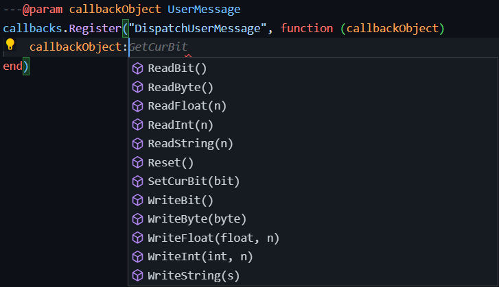

# Lmaobox Lua Annotations

Based on 22 Nov 2022 Update

> ***~~Lua~~ Lmaobox development just got a whole lot better*** 🧠 - LewdDeveloper

## Installation guide

### Visual Studio Code

1. Install the [LUA Extenstion](https://marketplace.visualstudio.com/items?itemName=sumneko.lua) for VSCode
2. Clone or download and extract this repo
3. Open VSCode and click on File -> Preferences -> Settings
4. On the left side, click Extensions -> Lua
5. Find **Workspace: Library** and click on **Add Item**
6. Select the **library** folder of this repo

*Shh, **${workspaceFolder}** is a [variable](https://code.visualstudio.com/docs/editor/variables-reference) in VSCode*

---

If you managed to setup correctly, confetti for you 🎉

Enjoy.

> PS, If you see named return value, yea.. I think it's a good idea to help user naming variable

### Learn how to use lua-language-server

[https://github.com/sumneko/lua-language-server/wiki/Settings](https://github.com/sumneko/lua-language-server/wiki/Settings)

## Adding more annotations

To know more about annotations, refer to [this wiki](https://github.com/sumneko/lua-language-server/wiki/Annotations)

Shortcut to make life easier**™**

1. 
2. 
3. [**https://youtu.be/R4jODwUCuMg**](https://youtu.be/R4jODwUCuMg "Regex + Multi Line Cursor")

## Console commands

| Command           | What it do[🤔](https://emojipedia.org/thinking-face/) |
| ----------------- | -------------------------------------------------- |
| lua_tc            | Toggle lua interactive console                     |
| lua_load [[path]] | Load a lua script in localappdata folder           |
| lua_exec [[code]] | evaluate lua code                                 |
| lua               | same as lua_exec                                   |

## TODO

- [ ] Call every possible function/methods and inspect it's return value.
- [ ]Add annotation tag for function that has meaningful/purposeful return value: **@nodiscard**
- [x] Find someone rewriting readme
- [ ] Find a dedicated maintainer.
